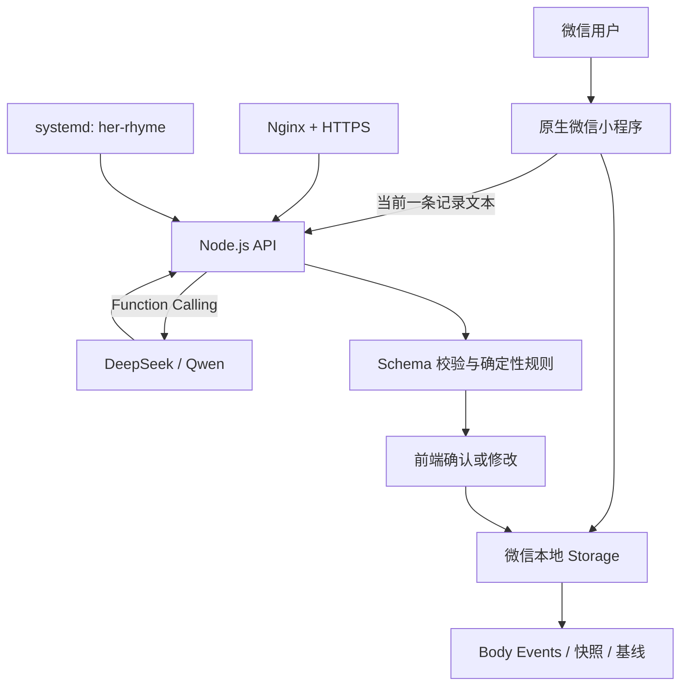

# Her Rhyme 项目交接手册

本文档用于让新的开发者或智能体仅凭 GitHub 仓库快速理解项目、运行代码、继续开发和准备发布。文档不包含任何 API Key、SSH 私钥或微信登录凭证。

## 1. 产品定位

Her Rhyme 面向 everyday active women。产品不是单一的经期工具、减脂计算器或健身课程库，而是通过低摩擦记录、个人计划和长期 Body Memory，帮助女性逐步形成对自身身体的认知与掌控。

当前最小闭环：

```text
建立档案 -> 选择或修改计划 -> 每日低摩擦记录 -> 用户确认结构化结果
-> 周/月/年归档 -> 建立个人基线 -> 反哺后续建议
```

产品长期方向：

- 一个通用自然语言入口负责理解用户的一句话，并拆解为身体事件。
- 运动、周期、饮食、睡眠和心情分别由专项 Agent 提供陪伴和建议。
- 所有 Agent 读取同一份经过确认的 Body Memory，而不是直接共享未经处理的聊天全文。
- Luna 是通用陪伴入口。当前只有动态问候和入口占位，尚未实现正式对话。
- 减脂只是应用场景之一，不是产品最终定位。

## 2. 产品原则

1. **先记录，再判断**：数据不足时明确说不足，不伪造身体规律。
2. **用户确认后入库**：模型解析不能直接写入 Body Memory。
3. **缺失不是 0**：未记录值保留为 `null` 或省略字段。
4. **建议不是诊断**：不诊断疾病，不把周期阶段当成必然症状。
5. **低摩擦优先**：一句话记录是主入口，复杂表单按具体场景逐步增加。
6. **本地数据优先**：备案、登录和隐私链路完成前，不自动同步敏感数据。
7. **克制的陪伴感**：Luna 可以友好，但不能用过度确定的语气替代专业判断。

## 3. 当前用户体验

底部四个主入口：

- **计划**：五个初始模板，支持快速添加、按模板修改、编辑已有计划、暂停和标记今日完成。
- **今日**：Luna 动态问候、一句话记录入口、正在执行的计划、基于近期真实训练记录的恢复提醒、五类单行记录入口和本周身体地图。
- **记录**：自然语言解析、识别结果确认和修改、周/月/年身体地图、最近记录。
- **我的**：个人档案、营养基线、Agent 记忆、研究数据导出和本地数据管理。

当前五个计划模板：

1. 16:8 饮食窗口
2. 一周均衡饮食
3. 每日 30 分钟训练
4. 周期感知恢复
5. 七日规律入睡

模板是可编辑起点，不是固定处方。后续可以为饮食、训练、睡眠和周期计划分别增加专项表单。

## 4. 技术架构



技术栈：

- 小程序：微信原生 WXML、WXSS、JavaScript
- 服务端：Node.js 原生 HTTP 服务，无 Web 框架
- 模型：DeepSeek 或 Qwen 的 OpenAI 兼容接口
- 进程管理：systemd
- 反向代理：Nginx
- 当前服务端存储：JSON 文件，仅适合 MVP
- 当前用户数据主存储：微信本地 Storage

当前不需要 LangGraph。现有解析链路是单次模型调用和确定性状态处理；只有升级为多事件路由、多 Agent 编排、节点重试和人工中断后，再评估 LangGraph。

## 5. 代码地图

| 路径 | 作用 |
| --- | --- |
| `app.json` | 页面注册、导航栏和四个 Tab |
| `app.wxss` | 全局视觉规范和通用控件 |
| `pages/welcome/` | 首次进入页 |
| `pages/plan/` | 计划模板、新建、编辑和完成状态 |
| `pages/today/` | Luna 问候、快捷记录、计划、恢复提醒和信号入口 |
| `pages/record/` | 自然语言解析、人工确认、归档和身体地图 |
| `pages/profile/` | 档案、基线、记忆、研究授权和数据管理 |
| `pages/insight/` | 早期身体洞察页，目前不在 Tab 中 |
| `utils/api.js` | 小程序 API 地址、用户临时编号和请求封装 |
| `utils/body-memory.js` | 身体事件、每日快照、基线成熟度和研究导出 |
| `utils/calculator.js` | 热量与营养计算 |
| `server/server.js` | API 路由、JSON 存储和限流 |
| `server/llm-parser.js` | Prompt、Function Schema、字段校验和安全规则 |
| `server/*.test.js` | 服务端、页面状态和回归测试 |
| `deploy/` | systemd 与 Nginx 配置样例 |
| `docs/body-memory.md` | Body Memory 字段和时间窗口 |

## 6. 自然语言解析边界

当前链路：

```text
一句话 -> Function Calling -> 服务端字段校验 -> 确定性规则
-> 前端识别卡片 -> 用户确认或修改 -> 本地归档 -> 纠错反馈
```

当前每次只归档一个主意图：

- `diet`
- `training`
- `sleep`
- `cycle`
- `mood`

Prompt 不是唯一保障。必须同时保留：

- 强制 `save_parsed_log` Function Calling
- 服务端类型和数值范围校验
- 基于原文和结构化结果的确定性规则
- Human-in-the-loop 确认
- Prompt 与规则版本号
- 用户纠错反馈

下一阶段若要支持一句话中的多个事件，应把返回结构升级为 `events[]`，并让每个事件独立确认、拒绝和回滚。

## 7. Body Memory 与基线

详细契约见 [`body-memory.md`](body-memory.md)。核心窗口：

- 3 个以下活跃日：`insufficient`
- 3-6 个活跃日：`building`
- 7-13 个活跃日：`provisional`
- 至少 14 个活跃日：行为基线 `established`
- 至少 3 次经期开始记录：周期基线 `established`
- 后续周期建议：至少 28 天滚动数据和 3 个周期后再做

今日页恢复提醒目前是确定性规则：

- 最近 1 天内有训练记录时可以提示恢复。
- 最近 3 天内有力量训练时可以提示恢复。
- 若近期同时有疲惫、压力、低落或较差睡眠记录，观察窗口最多延长到 4 天。
- 没有真实训练记录时不显示提醒。

## 8. 本地开发与验证

小程序 AppID 已写入 `project.config.json`：

```text
wx6c145a495fab7b60
```

打开项目：

1. 克隆 GitHub 仓库。
2. 在微信开发者工具中导入仓库根目录。
3. 使用有该小程序权限的微信账号登录。
4. 点击“编译”。

运行服务端：

```bash
cd server
npm start
```

运行测试：

```bash
cd server
npm test
```

交接时的测试基线为 `14/14` 通过。每次修改解析规则、计划编辑、今日提醒或 Body Memory 后，都应增加或更新回归测试。

## 9. 服务器与密钥

当前服务器：

- 公网 IP：`124.220.63.165`
- API 域名：`api.herhyme.site`
- 服务目录：`/home/ubuntu/her-rhyme-api`
- systemd 服务：`her-rhyme`
- Node 监听：`127.0.0.1:3000`

2026-08-04 实测状态：

- `https://124.220.63.165/health` 在忽略 IP 证书校验时返回 `200`。
- `https://api.herhyme.site/health` 仍被重置，不能用于小程序正式请求。
- `http://api.herhyme.site/health` 返回重定向。

密钥规则：

- SSH 私钥只保存在所有者本地，禁止加入仓库。
- `LLM_API_KEY` 只保存在服务器环境变量文件中，权限应为 `600`。
- 新接手者若只改代码，不需要接触任何密钥。
- 需要部署时，由所有者单独授权服务器访问，不通过 Issue、聊天截图或 GitHub 传递私钥内容。

常用检查：

```bash
sudo systemctl status her-rhyme
sudo journalctl -u her-rhyme -n 100 --no-pager
sudo nginx -t
sudo certbot certificates
curl https://api.herhyme.site/health
```

## 10. 如何先给少量用户体验

体验版不需要经过正式审核，但只能由管理员添加的体验成员打开。

1. 先确保小程序在微信开发者工具中可以正常编译。
2. 点击开发者工具右上角“上传”。
3. 填写版本号，例如 `0.1.0`，备注写明本次测试范围。
4. 登录微信公众平台，进入“管理 -> 版本管理”。
5. 在开发版本中把上传版本设为体验版。
6. 在“成员管理”中添加体验成员或项目成员。
7. 将体验版二维码发给这些成员。

当前域名 HTTPS 尚未打通，因此体验版里的自然语言 AI 解析可能失败；档案、计划、原文记录和身体地图仍可在本地使用。不要把开发环境的 IP HTTPS 当作正式解决方案。

## 11. 如何正式发布给所有微信用户

正式发布前按以下顺序完成：

### P0：必须完成

- 域名备案完成并处于可用状态。
- 为 `api.herhyme.site` 配置有效 HTTPS 证书，`/health` 返回 `200`。
- 在微信公众平台“开发管理 -> 开发设置 -> 服务器域名”中，把 `https://api.herhyme.site` 添加为 request 合法域名。
- 实现 `wx.login` 与服务端会话鉴权，不能继续依赖客户端生成的 `X-User-Id` 保护公开 API。
- 对解析接口增加用户级配额、日志告警和成本上限，避免模型 Key 被公开接口滥用。
- 完成《用户隐私保护指引》和隐私政策，明确说明身体记录保存在本地、当前一条文字会发送到服务端和模型提供方进行解析。
- 检查服务类目。选择微信后台当时可用、与运动/健康管理实际功能一致的类目；若后台要求资质，按提示补充，避免使用医疗诊断表述。

### P1：强烈建议完成

- 把服务端 JSON 文件存储升级为 PostgreSQL、腾讯云数据库或同等级持久化存储。
- 增加数据库备份、接口监控、错误告警和数据删除机制。
- 增加账号注销、云端数据导出和删除能力。
- 在真机上检查 iOS、Android、不同字体大小和弱网状态。
- 准备审核说明，写清核心路径：建档 -> 选择计划 -> 一句话记录 -> 确认 -> 身体地图。

### 提审与发布

1. 在微信开发者工具上传候选版本。
2. 在微信公众平台完成服务类目、隐私指引和版本说明。
3. 从“版本管理”选择开发版本并提交审核。
4. 按审核要求提供测试路径和必要说明。
5. 审核通过后点击“发布”。
6. 发布后立即用正式微信账号检查首页、计划、记录解析、原文兜底、数据删除和 API 健康状态。

## 12. 当前上线检查表

| 项目 | 状态 |
| --- | --- |
| 小程序 AppID | 已配置 |
| 四个主 Tab | 已完成 |
| 计划模板和编辑 | 已完成 |
| Luna 动态问候 | 已完成 |
| 自然语言结构化解析 | 已完成 |
| 用户确认后本地归档 | 已完成 |
| Body Memory 研究导出 | 已完成 |
| 自动化测试 | `14/14` 通过 |
| 公网 IP API | 可访问，仅适合内部联调 |
| 正式域名 HTTPS | 未完成 |
| 微信 request 合法域名 | 未完成 |
| 微信登录与服务端鉴权 | 未完成 |
| 正式数据库 | 未完成 |
| Luna 正式对话 | 未完成 |
| 隐私政策与小程序隐私指引 | 未完成 |
| 体验版上传 | 待所有者在开发者工具操作 |
| 正式审核与发布 | 未开始 |

## 13. 下一阶段建议顺序

1. 打通域名 HTTPS 和微信 request 合法域名。
2. 增加微信登录、服务端会话与用户级限流。
3. 上传体验版，邀请 5-10 名目标用户完成 7-14 天记录。
4. 根据纠错反馈完善结构化字段和低摩擦记录入口。
5. 完成隐私政策、云端数据删除和正式数据库。
6. 实现 Luna 通用对话，但先只读取近期摘要和用户授权的 Body Memory。
7. 数据足够后再升级多事件解析和专项 Agent。

## 14. 新接手者开始工作的方式

推荐给新的开发者或智能体以下指令：

```text
先阅读 README.md、docs/HANDOFF.md 和 docs/body-memory.md。
不要提交任何 API Key、SSH 私钥、证书或本地私有配置。
先运行 server 下的测试并用微信开发者工具编译。
修改时保持本地数据优先、用户确认后入库、缺失不是 0、建议不是诊断。
完成后说明改动、验证结果、已知限制和部署影响。
```
