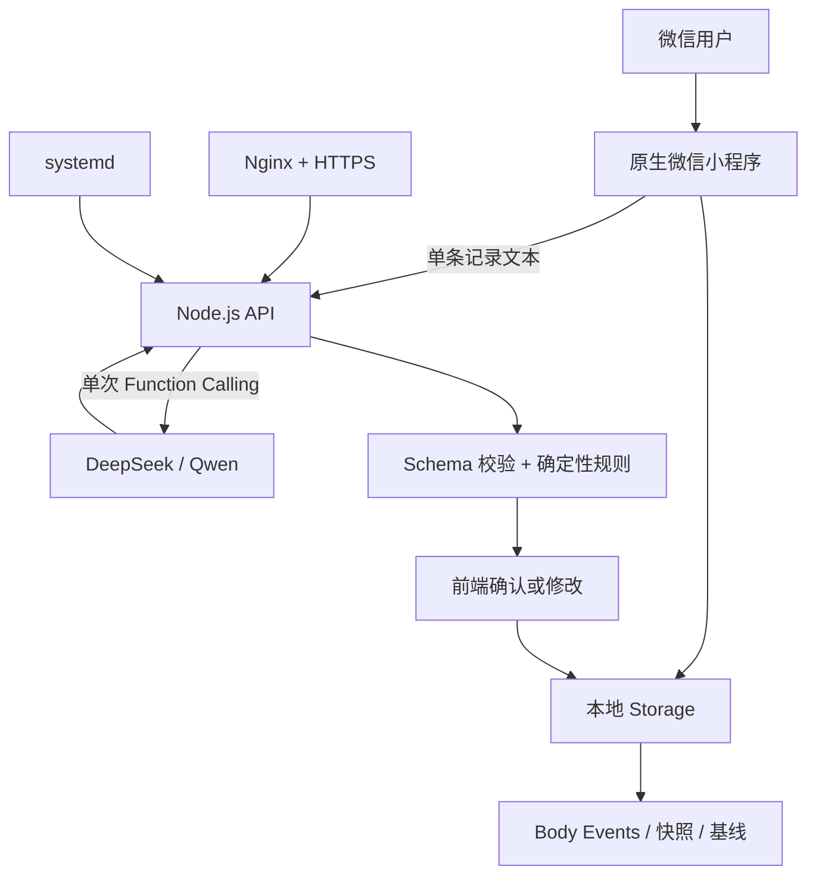
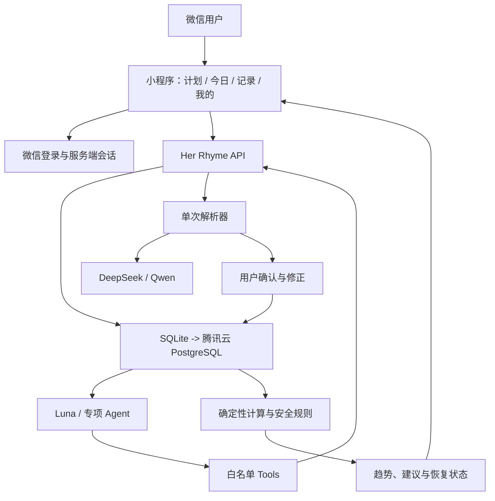
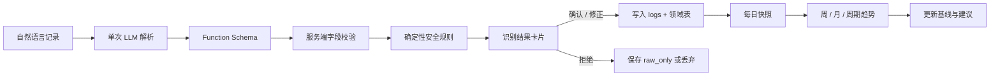

# Her Rhyme 产品与数据架构迭代方案

> 版本：Phase 1-4 规划稿
>
> 目标：在保持 MVP 简洁、可验证和可控的前提下，逐步把 Her Rhyme 从“身体记录工具”发展为由共享 Body Memory 支撑的女性身体认知与陪伴系统。

## 1. 产品定位

Her Rhyme 面向 everyday active women。它不是单一的经期工具、减脂计算器或课程库，而是通过低摩擦记录、个人计划和长期 Body Memory，帮助用户逐步形成对自身身体的认知与掌控。

减脂是一个重要应用场景，但不是最终定位。产品需要覆盖运动、生理周期、饮食、睡眠和心情，并让这些信号在长期记录中互相解释。

当前最小闭环：

```text
建立档案 -> 选择或修改计划 -> 每日低摩擦记录 -> 用户确认结构化结果
-> 周/月/年归档 -> 形成个人基线 -> 反哺后续建议
```

产品原则：

1. 先记录，再判断；数据不足时明确显示“不足”，不伪造规律。
2. 用户确认后入库；模型输出不能直接写入 Body Memory。
3. 缺失不是 0；未记录的字段保留为 `null` 或省略。
4. 建议不是诊断；不把周期阶段或单次信号表达成医疗结论。
5. 低摩擦优先；一句话记录是主入口，复杂表单按场景逐步增加。
6. 代码算账，LLM 读话，Agent 只负责替用户完成跨步骤操作。

## 2. 三层能力判断

对每个功能连续问三个问题：

### 第一层：结果确定，写代码

如果同样输入永远应该得到同样输出，就不使用 LLM：

- BMR、TDEE 和每日营养目标计算
- 解析后的饮食热量和蛋白质汇总
- 体重趋势与每周达标判断
- 基于平均周期长度和上次开始日期的周期预测
- “距预测经期还有 2 天”等提醒触发
- 数据窗口、基线成熟度和安全阈值判断

这部分是产品的事实层，必须可测试、可解释和可复现。

### 第二层：单次 LLM + JSON Schema

如果需要理解自然语言，但调用次数、输入和输出结构都是固定的，就使用单次模型调用，不使用 Agent：

- 一句话记录解析：自然语言 -> 结构化身体事件
- 食物名称、份量和热量的初步估算
- 将代码计算好的数字改写成用户能理解的洞察文案

这层的失败应当可以直接降级：解析失败则保留原文，文案失败则显示代码计算出的数字。模型不负责计算事实，也不直接修改用户数据。

### 第三层：Agent + Tools

只有当模型需要在运行时决定“查什么、改哪条、要不要再问一句”时，才引入 Agent：

- 用户说“把昨天那条训练记录删掉”
- 用户说“我这周吃得怎么样”，模型需要决定读取饮食、体重和计划数据
- 用户一句话同时涉及训练、睡眠和心情，需要拆分后分别路由
- 需要先查数据、向用户确认、再执行修改，并支持失败重试或人工中断

因此，Phase 1-3 不需要 LangGraph。Phase 4 的对话入口变复杂后，再考虑用 Agent 循环或 LangGraph 编排。

自检口诀：**代码算账，LLM 读话，Agent 只负责替用户按按钮。**

## 3. Her Rhyme 功能分层

| 产品能力 | 归属层 | 处理方式 |
| --- | --- | --- |
| 热量、BMR、TDEE、营养目标 | 纯代码 | `calculator.js` 计算，单元测试覆盖边界 |
| 饮食每日汇总 | 纯代码 | 对确认后的 `diet_items` 做 `SUM` |
| 体重趋势和周判断 | 纯代码 | 按周窗口比较实际变化与目标变化 |
| 周期预测 | 纯代码 | 使用周期开始记录和个人平均周期长度 |
| 提醒触发 | 纯代码 | 读取计划、近期事件和安全规则 |
| 一句话记录解析 | 单次 LLM | Function Calling 强制输出结构化结果 |
| 食物热量估算 | 单次 LLM + 用户确认 | 估算值可修改，修改后的值才参与汇总 |
| 周报/月报文字总结 | 单次 LLM | 代码先算指标，LLM 只负责表达 |
| Luna 通用对话 | Agent + Tools | Phase 4 再做，工具只能访问白名单 API |
| 多专项 Agent 协作 | Agent + Tools | 多事件拆分、路由和统一反馈完成后再做 |

## 4. 当前与目标架构

### 当前 MVP



### 目标架构



## 5. 数据管理决策

### 5.1 当前选择：SQLite

当前形态是单台腾讯云服务器、单个 Node 服务和 MVP 级写入量，优先采用 SQLite，服务端使用 `better-sqlite3`：

- 单文件、零额外运维，适合快速验证产品闭环
- 事务和并发控制优于当前 JSON 全量覆写
- 成本低，部署和备份简单
- 数据库访问只发生在服务端，小程序不直连数据库

不建议当前使用托管 Supabase：小程序仍需通过已备案的自有 API 访问，Supabase 的客户端直连、托管 Auth 和 Realtime 在此阶段都用不上；境内服务访问境外托管数据库也会增加延迟、稳定性和敏感信息合规风险。

### 5.2 升级条件：腾讯云 PostgreSQL

满足以下任一条件后再升级：

- 需要多台 API 服务器
- 写入并发明显增加
- 需要复杂统计、后台分析或多维查询
- 需要更成熟的备份、恢复、监控和权限能力

API 与数据库之间保留 DAO / Repository 边界，小程序接口不随数据库迁移改变。

## 6. 建议的数据模型

原始记录与结构化结果必须同时保留。`content` 用于重跑解析和追溯，`parsed` 用于展示与修正；可聚合字段单独成表，避免每次统计都从 JSON 中挖取。

```sql
CREATE TABLE users (
  id INTEGER PRIMARY KEY,
  openid TEXT UNIQUE NOT NULL,
  created_at TEXT DEFAULT (datetime('now'))
);

CREATE TABLE profiles (
  user_id INTEGER PRIMARY KEY REFERENCES users(id),
  height REAL,
  weight REAL,
  age INTEGER,
  sex TEXT,
  activity TEXT,
  updated_at TEXT
);

CREATE TABLE logs (
  id TEXT PRIMARY KEY,
  user_id INTEGER NOT NULL REFERENCES users(id),
  type TEXT NOT NULL CHECK (type IN ('diet','mood','training','sleep','cycle')),
  content TEXT NOT NULL,
  parsed TEXT,
  confirmation TEXT DEFAULT 'raw_only',
  created_at TEXT DEFAULT (datetime('now'))
);

CREATE TABLE diet_items (
  id INTEGER PRIMARY KEY,
  log_id TEXT NOT NULL REFERENCES logs(id),
  user_id INTEGER NOT NULL,
  date TEXT NOT NULL,
  name TEXT,
  amount TEXT,
  calories_est REAL,
  protein_est REAL,
  confirmed INTEGER DEFAULT 0
);

CREATE TABLE cycles (
  id INTEGER PRIMARY KEY,
  user_id INTEGER NOT NULL REFERENCES users(id),
  start_date TEXT NOT NULL,
  end_date TEXT,
  pain_level INTEGER,
  flow TEXT
);

CREATE TABLE weights (
  user_id INTEGER NOT NULL,
  date TEXT NOT NULL,
  weight REAL NOT NULL,
  PRIMARY KEY (user_id, date)
);

CREATE INDEX idx_logs_user_date ON logs(user_id, created_at);
CREATE INDEX idx_diet_user_date ON diet_items(user_id, date);
```

### 6.1 Body Memory 组成

Body Memory 不是完整聊天记录，而是经过确认、可追溯的共享身体上下文：

- **Body Events**：饮食、训练、睡眠、经期、心情等确认事件
- **Daily Snapshots**：按天聚合的身体信号
- **Plans**：用户正在执行的计划、目标、周期和完成情况
- **Baselines**：个人历史基线、计划基线和安全基线
- **Insights**：代码计算出的趋势指标和状态
- **Preferences**：用户主动保存的偏好，例如不吃某类食物
- **Feedback**：接受、修改、拒绝和保存原文等纠错反馈

专项 Agent 读取的是这些经过处理的字段，不直接读取未经授权的完整聊天全文。

## 7. 记录解析与数据入库链路



必须保留的兜底：

1. Function Calling 限制输出形状，不接受模型普通文本作为成功结果。
2. 服务端再次校验枚举、字符串长度、热量、蛋白质、时长、疼痛和周期范围。
3. 缺失字段不补成 0，不让缺失数据参与错误的平均值计算。
4. 模型失败时保存原文，但标记为 `raw_only`，不参与数值基线。
5. 用户确认或修正后才写入确认事件。
6. 保存 `prompt_version`、`rule_version` 和 `source_log_id`，保证结果可追溯。

## 8. 时间窗口与基线

| 窗口 | 用途 | 结论边界 |
| --- | --- | --- |
| 当日 | 展示今日状态、计划完成度和即时提醒 | 只描述今天，不判断长期规律 |
| 近 7 天 | 观察恢复、记录完整度和轻量趋势 | 适合温和建议，不适合宣布稳定基线 |
| 近 14 天 | 建立初步行为基线 | 14 个活跃日后才标记行为基线 established |
| 28 天滚动窗口 | 观察月度身体节律 | 数据充足后使用，不能替代医学判断 |
| 至少 3 次经期开始 | 建立周期基线 | 3 次前只显示 provisional 趋势 |

建议状态：

- 少于 3 个活跃日：`insufficient`
- 3-6 个活跃日：`building`
- 7-13 个活跃日：`provisional`
- 至少 14 个活跃日：行为基线 `established`

基线必须区分：

- **计划基线**：用户设定的目标或计划
- **历史基线**：用户确认记录形成的个人平均和波动范围
- **安全基线**：产品规则中的风险阈值和必须提醒的边界

## 9. Agent 与 Tools 规划

Phase 4 做 Luna 通用对话时，Agent 只能通过明确白名单工具访问业务能力：

| Tool | 用途 | 约束 |
| --- | --- | --- |
| `log_record` | 新增记录并调用解析器 | 仍需用户确认 |
| `list_records` | 查询记录 | 删除或修改前必须先查 |
| `update_record` | 修改确认记录 | 只允许修改白名单字段 |
| `delete_record` | 删除记录 | 必须先向用户确认 |
| `log_weight` | 记录体重 | 复用体重校验规则 |
| `get_today_status` | 读取今日状态 | 只返回必要字段 |
| `get_insight` | 读取已计算指标 | Agent 不重新计算 |
| `get_cycle_prediction` | 读取周期预测 | 预测逻辑仍由纯代码执行 |
| `save_note` | 保存用户主动指定的偏好 | 不把普通聊天自动变成长时记忆 |

建议初始限制：`MAX_LOOPS=5`，每次工具调用记录审计日志；删除、修改和写入操作必须有用户可见的确认节点。

## 10. 分阶段路线

### Phase 1：可用的记录闭环

- 完成单次 `/api/logs/parse`
- 完成 Function Schema、服务端校验和规则兜底
- 前端展示识别卡片，允许用户确认和修正
- 确认事件写入本地 Body Memory
- 保留原文和纠错反馈

### Phase 2：确定性数据层

- 用 SQLite 替换服务端 JSON 文件存储
- 增加 `users`、`profiles`、`logs`、领域表和索引
- 抽出 DAO 层，隔离 API 与数据库实现
- 增加每日备份、恢复演练和数据删除能力

### Phase 3：趋势与洞察

- 生成 Daily Snapshot
- 完成 7 天、14 天和 28 天窗口计算
- 代码先计算指标，再让 LLM 生成可选的自然语言总结
- 增加基线成熟度、缺失字段和数据质量提示

### Phase 4：Luna 通用对话与专项 Agent

- 接入微信登录和服务端会话鉴权
- 将已有 API 包装为白名单 Tools
- 支持先查后改、确认、重试和失败降级
- 一句话多事件拆分后，再路由运动、周期、饮食、睡眠和心情 Agent
- 共享 Body Memory，但按领域最小化读取上下文

### Phase 5：规模化数据服务

- 需要多实例或高并发时迁移到腾讯云 PostgreSQL
- 增加监控、告警、成本控制、异步任务和审计日志
- 完善导出、删除、注销和隐私授权管理

## 11. 发布前必须补齐

涉及经期、体重、睡眠和身体状态的数据属于高敏感用户数据。正式收集云端数据前，至少需要：

- 微信登录和服务端鉴权，不能依赖客户端自定义用户 ID
- 隐私政策和用户授权流程
- 数据导出、删除和账号注销能力
- API 限流、模型成本上限和错误告警
- 数据库备份与恢复验证
- 正式域名、HTTPS 和微信合法域名配置
- 明确“建议不是医疗诊断”的产品边界

这份方案不把合规当作上线后的补丁，而是数据架构的一部分。先让记录闭环真实可用，再逐步增加云同步和 Agent 能力，能让每一步都可验证、可回滚。
