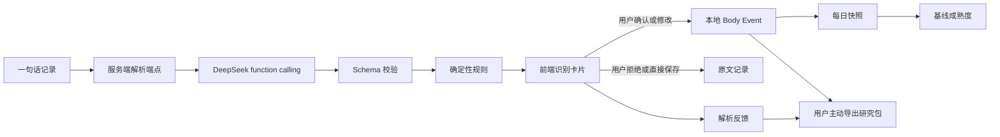
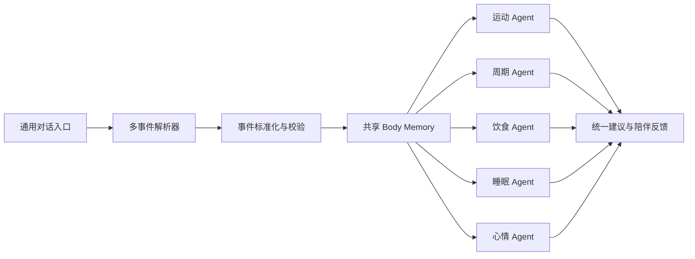

# Body Memory 数据架构

Her Rhyme 的 Body Memory 不是一段让模型自由阅读的聊天记录，而是经过确认的身体事件、每日快照、基线状态和可追溯反馈。

## 当前链路

当前 MVP 每条输入只保留一个主意图：`diet`、`training`、`sleep`、`cycle` 或 `mood`。这让现有确认卡片和本地身体地图稳定可用，但不会假装已经完成多 Agent 路由。

## 事件字段

每条确认后的事件由 `utils/body-memory.js` 生成：

| 字段 | 含义 |
| --- | --- |
| `event_id` | 与本地日志稳定关联的事件编号 |
| `domain` | 饮食、训练、睡眠、经期或心情 |
| `event_type` | 统一事件类型，例如 `diet_intake` |
| `occurred_at` / `date` | 发生时间和本地日期 |
| `data` | 该领域的结构化字段 |
| `source` | LLM 解析或本地原文保存 |
| `confirmation` | `user_confirmed` 或 `raw_only` |
| `raw_text` | 只有用户单独授权时才导出 |

缺失不是 0。比如没有填写热量时，`diet_calories_est` 为 `null`；只有用户明确记录了 0，才允许形成数值 0。

## 时间窗口

- 每日：把同一天的饮食、训练、睡眠、经期和心情聚合成一个 `daily_snapshot`，用于展示和后续计算。
- 7 天：用于观察记录完成度和给出轻量建议，不用于判定长期趋势。
- 14 天：当前代码将 14 个活跃日视为行为基线 `established` 的最低门槛；3 天以下为 `insufficient`，3-6 天为 `building`，7-13 天为 `provisional`。
- 周期：经期基线单独统计经期开始事件，1 次只能算 `provisional`，至少 3 次才算 `established`。
- 后续：有足够数据后，再使用 28 天滚动窗口和至少 3 个周期做周期相关建议；在此之前只显示趋势，不做确定性判断。

## 兜底层

1. **输出约束**：只有 `save_parsed_log` function call，禁止普通文本作为成功结果。
2. **字段校验**：类型枚举、字符串长度、热量/蛋白质、训练和睡眠时长、周期天数、疼痛等级全部由服务端复核。
3. **数据质量规则**：缺失食物份量、缺失训练时长、缺失睡眠详情、短睡眠、长训练、高疼痛和营养估算缺失都返回规则信号。
4. **人工确认**：模型结果不直接进入 Body Memory，用户确认或修改后才形成 `user_confirmed` 事件。
5. **可回退**：模型不可用时可以保存 `raw_only` 原文；这条记录不能参与数值基线计算。
6. **安全边界**：规则只提示核验和寻求专业帮助，不做疾病诊断，不把周期阶段当作医疗结论。

## 反馈如何使用

反馈先保存为数据，不直接修改线上 Prompt：

- `accepted`：模型结果无需修改。
- `corrected`：用户修改了模型结果，可用于离线评测字段准确率。
- `saved_without_parsing`：服务不可用或用户不希望解析。

每条反馈带 `prompt_version`、`rule_version` 和 `source_log_id`，后续可以把原始输入（仅在用户授权原文导出时）与原始结果、最终结果对齐。只有经过脱敏和人工复核的样本，才应进入 Prompt 回归测试集。

## 下一阶段：多 Agent

未来的通用入口应把一次输入拆成多个事件，再按 `domain` 路由：

这一步需要把当前 `type` 改成 `events[]`，让每个事件独立确认和回滚，再考虑 LangGraph。当前单主意图解析不需要 LangGraph，普通 Node API 已足够。
